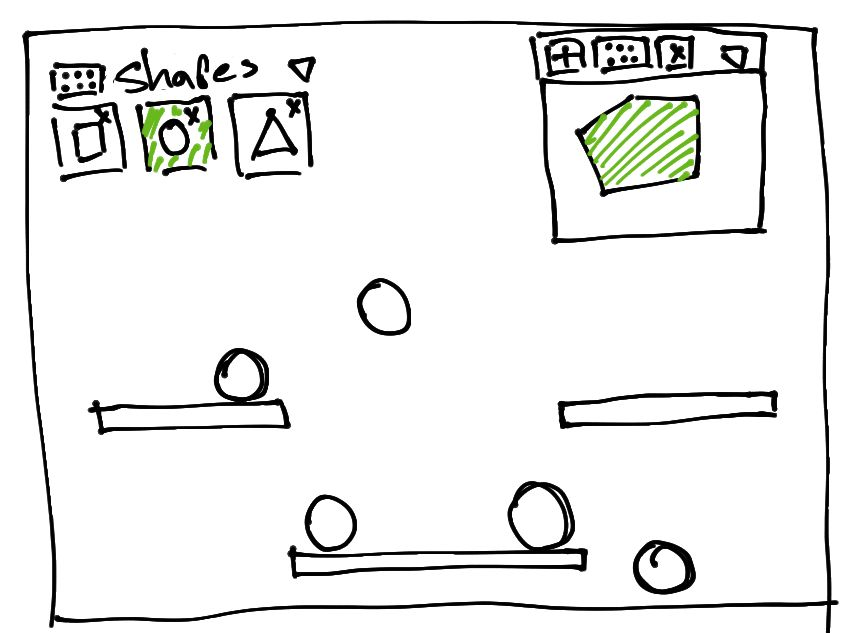

# Polygons

I want to built a simple app where the user can draw polygons and add them to the world. The app will look like this

The background will be a canvas that covers the entire screen, the user can add an instance of one of the selected shapes in the menu on the top left corner. The user can add new shapes to the menu with the widget on the top right corner. The menu and the widged can be dragged around the screen and closed.

I want to have an animation loop in the background canvas, and the widged, I'll try to componentize that. I'll be using a physics engine to update the states of the bodies in the background canvas. That physics engine comes with a renderer, so I'd like to toggle between debug view, and my own view, which may complicate componentizing the animation. That also means that I forgot a button to enable/disable debug view in the image above. I'll make that button draggable as well. That may complicate some aspects of dragging stuff in the canvas, in particular the part where I drag a draggable above another draggable. If I don't do anything the order in which the elements are in the HTML will dictate how they are rendered, for example, if I have A, B, and C, in that order in the HTML, and if I drag B around, it will move over A, and under C, always. I'd like to update the z-index, so that the element that is currently being dragged has the highest z-index. I'd need to get all other draggables when dragging starts. It'd be easier to imperatively update their z-index, which feels wrong since I'll be using a declarative framework, but since I'll be updating the animations 60 frames per second at best, I think there's more stuff I'll have to do that wouldn't make much sense to use a DOM framework for.

Since there's a menu from which the user can select what shapes to draw, and new shapes are added to that menu after being created by the drawing component, it seems like a lot of state will be controlled from above. There will be a component that will hold which shapes the menu is to display. Those shapes will be most likely in an array that we keep track of with a signal, so the menu is passed down a setter that it can use to remove shapes, since displaying and removing shapes is all the menu will do. It will also be draggable, and minimazable, but that's not something it itself would have to keep track of. This parent component that manages what shapes are drawn by the menu will also pass down a setter to the drawing component to add new shapes.

