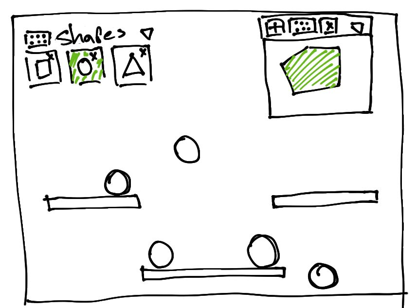

# Polygons

I want to built a simple app where the user can draw polygons and add them to the world. The app will look like this



The background will be a canvas that covers the entire screen, the user can add an instance of one of the selected shapes in the menu on the top left corner. The user can add new shapes to the menu with the widget on the top right corner. The menu and the widged can be dragged around the screen and closed.

I want to have an animation loop in the background canvas, and the widged, I'll try to componentize that. I'll be using a physics engine to update the states of the bodies in the background canvas. That physics engine comes with a renderer, so I'd like to toggle between debug view, and my own view, which may complicate componentizing the animation. That also means that I forgot a button to enable/disable debug view in the image above. I'll make that button draggable as well. That may complicate some aspects of dragging stuff in the canvas, in particular the part where I drag a draggable above another draggable. If I don't do anything the order in which the elements are in the HTML will dictate how they are rendered, for example, if I have A, B, and C, in that order in the HTML, and if I drag B around, it will move over A, and under C, always. I'd like to update the z-index, so that the element that is currently being dragged has the highest z-index. I'd need to get all other draggables when dragging starts. It'd be easier to imperatively update their z-index, which feels wrong since I'll be using a declarative framework, but since I'll be updating the animations 60 frames per second at best, I think there's more stuff I'll have to do that wouldn't make much sense to use a DOM framework for.

Since there's a menu from which the user can select what shapes to draw, and new shapes are added to that menu after being created by the drawing component, it seems like a lot of state will be controlled from above. There will be a component that will hold which shapes the menu is to display. Those shapes will be most likely in an array that we keep track of with a signal, so the menu is passed down a setter that it can use to remove shapes, since displaying and removing shapes is all the menu will do. It will also be draggable, and minimazable, but that's not something it itself would have to keep track of. This parent component that manages what shapes are drawn by the menu will also pass down a setter to the drawing component to add new shapes.

I feel like componentizing the animation would be more trouble than what it's worth it since I'd be basically just calling an init function that starts the animation; the code in whatever component uses the animation component wouldn't be significantly more complicated than if it the component were to set up the animation stuff itself.

For now I'll focus on the other components.

The menu displays the shapes and lets the user select one. How do I display the shapes? I want to display them as images. They should be displayed smaller than they are in reality. I need an image, I can just get one by calling `toDataURL` on the canvas before calling the parent setter in the factory, and the parent would hold polygon objects with two properties; the vertices array, and the image for the menu to display. That sounds about right, except that it kind of doesn't. If the user draws a small polygon that only takes a quarter of the screen then the resulting image will look weird with a lot of empty space. I Think I should do some for of the following:
Find the bounding box of the polygon, create a canvas with a specific size, like 100x100, scale the polygon and its bounding box to fit in this canvas, draw the polygon and extract the image as a data URL. I think I may have to translate the polygon so its centroid ends up at the origin.

Let's go about this a bit more carefully. First translate the polygon so its centroid is at the origin, then find its bounding box. Now scale the whole thing so that it fits perfectly in a 100x100 canvas. Then draw the polygon, and finally create an image from the canvas.

I'm not sure how I'll do the scaling thing. I think the way to do it would be by finding the longest side of the bounding box, finding the ratio of 100 to the longest side, and using this to scale everything. Would this actually work, and how do I scale things? do I just multiply the ratio by each vertex? Assume the longest side is 20, then the ratio is 100 / 20 = 5, multiplying every vertex by this ratio would make it five times as long. There's also the issue that now that all polygons are drawn to fit a 100x100 canvas there's no way to tell them appart in terms of size, which may be an issue, but I'll leave that for later.

For now I'll assume that's the right approach. Then I think the function could look like this

```javascript
function find_bb_dimensions(vertices) {
  const xMin = Math.min(...vertices.map((v) => v.x));
  const xMax = Math.max(...vertices.map((v) => v.x));
  const yMin = Math.min(...vertices.map((v) => v.y));
  const yMax = Math.max(...vertices.map((v) => v.y));
  const width = xMax - xMin;
  const height = yMax - yMin;
  const center = { x: xMin + width / 2, y: yMin + height / 2 };
  const box = {
    width,
    height,
    center,
  };

  return box;
}

function frame_polygon(vertices, width, height, fillStyle) {
  const canvas = document.createElement("canvas");
  const context = canvas.getContext("2d");
  const box = find_bb_dimensions(vertices);
  const boxLongest = Math.max(box.width, box.height);
  const canvasShortest = Math.min(width, height);
  const scale = canvasShortest / boxLongest;
  const centered = vertices.map((v) => ({
    x: (v.x - box.center.x) * scale,
    y: (v.y - box.center.y) * scale,
  }));

  canvas.width = width;
  canvas.height = height;

  context.beginPath();
  context.fillStyle = fillStyle;
  context.translate(width / 2, height / 2);
  context.moveTo(centered[0].x, centered[0].y);

  for (let i = 1; i < centered.length; i++)
    context.lineTo(centered[i].x, centered[i].y);

  context.fill();

  return canvas.toDataURL();
}
```

I can get the images. Now what? As pointed out above, since the polygons are fit on a 100x100 image, they all look like they are at the same scale. I could add a footnote indicating the real dimensions of the bounding box, or I could add an area above the list of polygons to preview the real size, then I'd have to create two images, a thumbnail, and one for the actual size. I'll do the later.