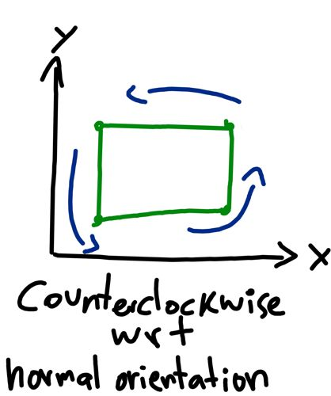

# Concave, Convex or Complex

I want to determine if a polygon is concave, convex, or complex, but first I have to build an app where I can add a bunch of points to create a polygon. Just for fun, I'll also make it possible to move the polygon around with the mouse.

How do I add a polygon to the screen? In the beginning there's nothing, and when the user first triggers a click event a point is added to the canvas where the user clicked. That point is added to an array of points, and a line is continuosly drawn from the point to the mouse. So I'll need a boolean variable that will indicate if the user is adding a new polygon.

Before the first click, that variable is false, but after it it is set to true.

I have something going on down there

```html
<!DOCTYPE html>
<html lang="en">
  <head>
    <meta charset="UTF-8" />
    <meta name="viewport" content="width=device-width, initial-scale=1.0" />
    <title>Polygon</title>
    <style>
      *,
      *::before,
      *::after {
        margin: 0;
        padding: 0;
        box-sizing: border-box;
      }

      body {
        background-color: rgb(19, 4, 48);
        display: grid;
        place-items: center;
        min-height: 100vh;
      }

      .controls {
        background-color: rgba(183, 170, 157, 0.5);
        color: white;
        position: fixed;
        top: 25px;
        right: 25px;
        padding: 10px;
        border-radius: 5px;
        display: flex;
        flex-direction: column;
        gap: 10px;
      }
    </style>
  </head>
  <body>
    <canvas></canvas>
    <div class="controls">
      <label>
        <span>move polygon</span>
        <input type="radio" name="radio-group" id="radio-move" />
      </label>
      <label>
        <span>add polygon</span>
        <input type="radio" name="radio-group" id="radio-add" checked />
        <button>reset</button>
      </label>
    </div>
    <script>
      function Polygon(vertices) {
        //check that the vertices are arranged in a clockwise manner
        //give it the correct type
        const type = Polygon.types.CONVEX; //fix this

        this.vertices = vertices;
        this.type = type;

        switch (type) {
          case Polygon.types.CONVEX:
            this.color = "greenyellow";
            break;
          case Polygon.types.CONCAVE:
            this.color = "orange";
            break;
          case Polygon.types.COMPLEX:
            this.color = "red";
            break;
        }
      }

      Polygon.prototype.draw = function (context) {
        context.beginPath();
        context.fillStyle = this.color;
        context.moveTo(this.vertices[0].x, this.vertices[0].y);
        for (let i = 1; i < this.vertices.length; i++)
          context.lineTo(this.vertices[i].x, this.vertices[i].y);
        context.fill();
      };

      Polygon.types = {
        CONVEX: "CONVEX",
        CONCAVE: "CONCAVE",
        COMPLEX: "COMPLEX",
      };
    </script>
    <script>
      function is_point_in_circle(point, circle) {
        const d2 =
          (circle.center.x - point.x) * (circle.center.x - point.x) +
          (circle.center.y - point.y) * (circle.center.y - point.y);
        const r2 = circle.radius * circle.radius;

        return d2 <= r2;
      }

      function draw_circle(context, center, radius, color) {
        context.beginPath();
        context.fillStyle = color;
        context.arc(center.x, center.y, radius, 0, Math.PI * 2);
        context.fill();
      }

      function draw_path(context, vertices) {
        if (vertices.length > 1) {
          context.beginPath();
          context.strokeStyle = "skyblue";
          context.moveTo(vertices[0].x, vertices[0].y);
          for (let i = 1; i < vertices.length; i++)
            context.lineTo(vertices[i].x, vertices[i].y);
          context.stroke();
        }

        for (let vertex of vertices) {
          draw_circle(context, vertex, 5, "gray");
        }
      }
    </script>
    <script>
      const canvas = document.querySelector("canvas");
      const context = canvas.getContext("2d");
      const polygons = [];
      let tempVertices, isBuilding, isAdding, pot, isClose;

      function anime() {
        context.clearRect(0, 0, canvas.width, canvas.height);

        for (let polygon of polygons) polygon.draw(context);

        if (isBuilding) {
          draw_path(context, [...tempVertices, pot]);

          if (isClose)
            draw_circle(context, tempVertices[0], 10, "rgb(100, 255, 200, .5)");
        }

        requestAnimationFrame(anime);
      }

      function init() {
        canvas.width = innerWidth;
        canvas.height = innerHeight;

        tempVertices = [];
        isBuilding = false;
        isAdding = true;
        pot = { x: 0, y: 0 };

        window.addEventListener("click", (event) => {
          if (isAdding) {
            const vertex = { x: event.offsetX, y: event.offsetY };
            const center = tempVertices[0];
            const circle = { center: center, radius: 10 };

            if (
              center &&
              is_point_in_circle(vertex, circle) &&
              tempVertices.length >= 2
            ) {
              const polygon = new Polygon(tempVertices);

              polygons.push(polygon);
              tempVertices = [];
              isBuilding = false;
            } else {
              isBuilding = true;
              tempVertices.push(vertex);
              pot.x = vertex.x;
              pot.y = vertex.y;
            }
          } else {
          }
        });

        window.addEventListener("mousemove", (event) => {
          if (isAdding && isBuilding) {
            const circle = { center: tempVertices[0], radius: 10 };

            pot.x = event.offsetX;
            pot.y = event.offsetY;

            if (tempVertices.length > 2 && is_point_in_circle(pot, circle))
              isClose = true;
            else isClose = false;
          } else {
          }
        });

        requestAnimationFrame(anime);
      }

      init();
    </script>
  </body>
</html>
```

There's an [answer in SO](https://stackoverflow.com/questions/471962/how-do-i-efficiently-determine-if-a-polygon-is-convex-non-convex-or-complex/45372025#45372025) that claims to answer if a polygon is strictly convex. Checking that a polygon is strictly convex or not is enough for me, so I'll have the Polygon class have only two types instead of three.

I have an array of vertices, and I need them to be listed in clockwise order with respect to the screen


or counterclockwise with respect to the axes



If the method above can tell the convexionality of the polygon regardless of the direction the vertices are listed in, then that would make things easier. First I'll translate the function from python to js:

Here's the python function

```python
TWO_PI = 2 * pi

def is_convex_polygon(polygon):
    """Return True if the polynomial defined by the sequence of 2D
    points is 'strictly convex': points are valid, side lengths non-
    zero, interior angles are strictly between zero and a straight
    angle, and the polygon does not intersect itself.

    NOTES:  1.  Algorithm: the signed changes of the direction angles
                from one side to the next side must be all positive or
                all negative, and their sum must equal plus-or-minus
                one full turn (2 pi radians). Also check for too few,
                invalid, or repeated points.
            2.  No check is explicitly done for zero internal angles
                (180 degree direction-change angle) as this is covered
                in other ways, including the `n < 3` check.
    """
    try:  # needed for any bad points or direction changes
        # Check for too few points
        if len(polygon) < 3:
            return False
        # Get starting information
        old_x, old_y = polygon[-2]
        new_x, new_y = polygon[-1]
        new_direction = atan2(new_y - old_y, new_x - old_x)
        angle_sum = 0.0
        # Check each point (the side ending there, its angle) and accum. angles
        for ndx, newpoint in enumerate(polygon):
            # Update point coordinates and side directions, check side length
            old_x, old_y, old_direction = new_x, new_y, new_direction
            new_x, new_y = newpoint
            new_direction = atan2(new_y - old_y, new_x - old_x)
            if old_x == new_x and old_y == new_y:
                return False  # repeated consecutive points
            # Calculate & check the normalized direction-change angle
            angle = new_direction - old_direction
            if angle <= -pi:
                angle += TWO_PI  # make it in half-open interval (-Pi, Pi]
            elif angle > pi:
                angle -= TWO_PI
            if ndx == 0:  # if first time through loop, initialize orientation
                if angle == 0.0:
                    return False
                orientation = 1.0 if angle > 0.0 else -1.0
            else:  # if other time through loop, check orientation is stable
                if orientation * angle <= 0.0:  # not both pos. or both neg.
                    return False
            # Accumulate the direction-change angle
            angle_sum += angle
        # Check that the total number of full turns is plus-or-minus 1
        return abs(round(angle_sum / TWO_PI)) == 1
    except (ArithmeticError, TypeError, ValueError):
        return False  # any exception means not a proper convex polygon

```


What does `old_x, old_y = polygon[-2]` mean? If I try to run

```python
array = [1, 2, 3, 4, 5]
a, b = array[-2]
print(a)
print(b)
```

with python3 it gives me the error

```
TypeError: cannot unpack non-iterable int object
```

---

It seems like `old_x, old_y = polygon[-2]` is getting the next to last vertex in the array, and unpacking it, I guess the equivalent in javaScript would be

```javascript
const vertices = [
  { x: 0, y: 0 },
  { x: 1, y: 1 },
  { x: 0, y: 2 },
];
const { x, y } = vertices.at(-2);

console.log(`x: ${x}, y: ${y}`); // "x: 1, y: 1"
```

And I can guess that in `for ndx, newpoint in enumerable(polygon)` the variable `ndx` refers to the numerical index, and `newpoint` to the vertex object. With that in mind, I think the translation is

```javascript
function is_convex(polygon) {
  if (polygon.length < 3) return false;

  const PI = Math.PI;
  const TWO_PI = PI * 2;
  let { x: oldX, y: oldY } = polygon.at(-2);
  let { x: newX, y: newY } = polygon.at(-1);
  let newDirection = Math.atan2(newY - oldY, newX - oldX);
  let angleSum = 0;
  let oldDirection, orientation;

  for (let i = 0; i < polygon.length; i++) {
    const point = polygon[i];

    oldX = newX;
    oldY = newY;
    oldDirection = newDirection;

    newX = point.x;
    newY = point.y;
    newDirection = Math.atan2(newY - oldY, newX - oldX);

    if (oldX === newX && oldY === newY) return false;

    let angle = newDirection - oldDirection;

    if (angle <= -PI) angle += TWO_PI;
    else if (angle > PI) angle -= TWO_PI;

    if (i) {
      if (orientation * angle <= 0) return false;
    } else {
      if (!angle) return false;

      orientation = angle > 0 ? 1 : -1;
    }

    angleSum += angle;
  }

  return Math.abs(Math.round(angleSum / TWO_PI)) === 1;
}
```

Now I just have to test it. Does the order of the vertices matter? After testing the function on these polygons


it looks like it doesn't. Still, matter.js does care about the order of the vertices. Assuming I only feed it convex polygons, I first have to make sure the order of the vertices is clockwise. I want to think that the solution consists of just comparing the first vertex to the second, and (kind of) reversing the array if something is true.

I'll use the normal orientation of the axes, so the vertices have to be listed in a counterclockwise manner.

I'm bad at math, so rather than trying to solve the problem, I'll copy [this solution](https://math.stackexchange.com/questions/978642/how-to-sort-vertices-of-a-polygon-in-counter-clockwise-order), test it with a few examples, and go with it if it works.

```javascript
function find_center(polygon) {
  const point = { x: 0, y: 0 };

  for (let i = 0; i < polygon.length; i++) {
    point.x += polygon[i].x;
    point.y += polygon[i].y;
  }

  point.x /= polygon.length;
  point.y /= polygon.length;

  return point;
}

function rearrange(polygon) {
  const center = find_center(polygon);

  polygon.sort((p1, p2) => {
    const a = Math.atan2(p1.y - center.y, p1.x - center.x);
    const b = Math.atan2(p2.y - center.y, p2.x - center.x);

    return b - a;
  });
}
```

It doesn't seem to work. I thought in

```java
double a1 = (Math.toDegrees(Math.atan2(a.x - center.x, a.y - center.y)) + 360) % 360;
```

the xs first was a mistake, since `atan2` takes the y first, so I "fixed" that bug, but it seems to be the right thing to do since I don't get glitches by using the source implementation.

```javascript
Polygon.reorder = function (polygon) {
  const center = Polygon.find_centroid(polygon);

  polygon.sort((p1, p2) => {
    const a = Math.atan2(p1.x - center.x, p1.y - center.y);
    const b = Math.atan2(p2.x - center.x, p2.y - center.y);

    return b - a;
  });
};
```

I'll assume that's the correct way unless I see any bugs.

I need to find a way to check if a point is inside a polygon. I tried [this one](https://stackoverflow.com/questions/1119627/how-to-test-if-a-point-is-inside-of-a-convex-polygon-in-2d-integer-coordinates#answer-1119673) out, but it looks like I made a mistake, and it doesn't seem to work. I also tried [this one](https://stackoverflow.com/questions/217578/how-can-i-determine-whether-a-2d-point-is-within-a-polygon#answer-2922778), but it doesn't work either.

---

Looks like in both cases I forgot the polygon variable represented an object rather than an array.
